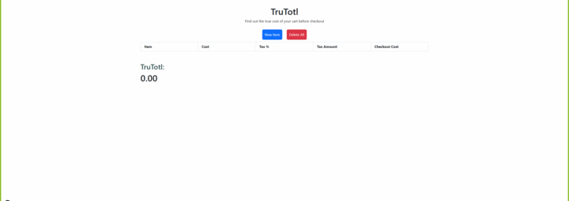

# TruTotl

## Overview
TruTotl is a web application designed to help users calculate the total cost of items they wish to purchase, including taxes. The application provides a user-friendly interface to input item details, view calculated totals, and manage a list of items, all while storing data locally on the browser.
---
## Features
- Dynamic Item Management: Add/remove items with their cost and tax percentage, and view real-time calculations.
- Tax Calculations: Automatically calculate tax amounts and final item costs.
- Persistent Storage: Data is saved to the browser's local storage, allowing users to revisit their lists even after refreshing the page.
- Responsive Design: Built with Bootstrap 5, ensuring mobile-friendly and responsive UI.
- Modal Interface: User-friendly modals for inputting and saving data.
---
## URL
https://dattanmando.github.io/TruTotl/
## Installation
1. Clone the repository:
bash
   git clone https://github.com/dattanmando/TruTotl.git
2. Navigate to the project directory:
bash
   cd trutotl
3. Open index.html in your preferred web browser.
---
## User Story: Manage and Calculate Item Costs with Tax

As a user of the TruTotl web application,  
I want to input item details (name, cost, and tax percentage) and view calculated totals in a user-friendly interface,  
so that I can easily manage my purchase list and know the final costs, including taxes.

## Acceptance Criteria

### 1. Item Entry Modal
**Given** the user opens the TruTotl application,  
**When** the user clicks the "New Item" button,  
**Then** a modal form should appear to input the item name, cost, and tax percentage.

### 2. Item List with Calculated Totals
**Given** the user fills in the modal form and clicks "Save,"  
**When** the user views the item list,  
**Then** the newly added item should appear with its tax amount and total cost calculated and displayed.

### 3. Persistence of Items
**Given** the user has added multiple items,  
**When** the user refreshes the browser page,  
**Then** the previously added items should persist and reload from the browser's local storage.

### 4. Clear All Items
**Given** the user wants to remove all items,  
**When** the user clicks the "Clear/Remove All" button,  
**Then** all items should be removed from the display and the local storage.

### 5. Responsive UI
**Given** the user is using a mobile or desktop device,  
**When** they interact with the application,  
**Then** the UI should be fully responsive and adjust to their screen size.

### 6. Total Calculation
**Given** an item list with calculated totals,  
**When** the user views the totals section,  
**Then** the application should show a dynamic calculation of the total tax and total cost of all items.

## Technologies Used
- HTML5: Markup structure.
- CSS3: Styling with Bootstrap 5.
- ChatGPT 4o: Bugfixing code.
- JavaScript: Application logic and DOM manipulation.
- Bootstrap 5.3.3: Responsive design and modal implementation.
- Local Storage: Persistent data storage.
---
## File Structure
    TruTotl/
    ├── assets/
    │   ├── CSS/
    │   │   └── style.css        # Main stylesheet
    │   ├── JS/
    │   │   └── script.js        # Core JavaScript logic
    │   ├── TruTotl UI Screenshot.png
    ├── .gitignore               # Git ignore file
    ├── index.html               # Main HTML file
    ├── LICENSE                  # License file
    └── README.md                # Project documentation
---
## Version
Current Version 1.1.0
- Added clear/remove button
## Contributing
Contributions are welcome! Please follow these steps:
1. Fork the repository.
2. Create a feature branch:
bash
   git checkout -b feature-name
3. Commit your changes:
bash
   git commit -m "Add new feature"
4. Push to the branch:
bash
   git push origin feature-name
5. Open a Pull Request.
---
## License
    This project is licensed under the MIT License. See the LICENSE file for details.
---
## Contact
For inquiries or support, submit an issue on GitHub.